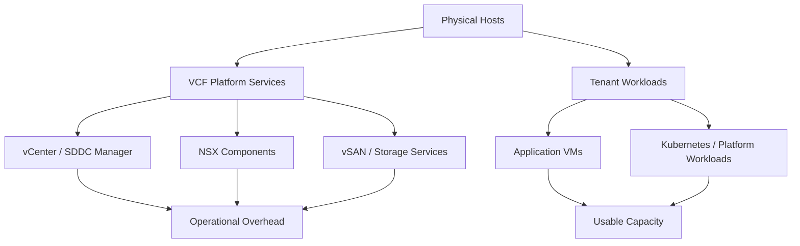

# Preparing Your VMware Cloud Foundation Platform for the Next Hardware Refresh Cycle

Hardware refresh planning has become one of the most consequential architecture decisions in modern private cloud design. CPU generations move faster than enterprise procurement cycles, memory prices remain volatile, storage density and performance expectations continue to climb, and platform teams are being asked to do more with fewer refresh opportunities. For VMware Cloud Foundation (VCF) environments, that combination makes the next hardware cycle less about buying the newest platform and more about extracting maximum usable life from the estate already in place.

That is the architectural problem this post addresses. The core question is not whether new hardware is faster. Of course it is. The real question is whether the current fleet can be re-used safely and economically as a VCF 9.x platform, and how much engineering discipline is required to make that decision without creating operational risk later.

This is a practical topic because many organizations are facing the same constraints at the same time:

- delayed capital spend,
- uneven server refresh ages across clusters,
- memory pressure outpacing CPU pressure,
- increasing interest in consolidation,
- and a growing desire to preserve flexibility for future workload placement.

VCF is well suited to this kind of optimization because it gives you a consistent platform layer, but that consistency does not eliminate hardware design choices. It simply makes the consequences more visible.

## Start with the platform, not the purchase order

The first mistake in a refresh cycle is treating the server catalog as the design input. The design input should be the workload profile.

Before deciding whether to re-use servers, extend a cluster, or refresh in place, answer four questions:

1. What is the current and projected memory demand of the platform?
2. Which workloads are CPU-bound versus memory-bound?
3. What level of consolidation is operationally acceptable?
4. How much hardware heterogeneity can the operations team tolerate?

Those questions matter more than raw benchmark numbers because VCF environments are not built to chase synthetic performance. They are built to provide predictable capacity, lifecycle consistency, and recoverability under pressure.

If the platform is primarily constrained by memory headroom, then the next hardware cycle may need to emphasize DIMM population, memory bandwidth, and capacity per socket. If the platform is constrained by CPU scheduling density, then core count, frequency, cache characteristics, and supported processor generations become the dominant variables. In many cases, the bottleneck is actually a combination of both, with the cluster looking “fine” on paper until vCenter, NSX, vSAN, and tenant workloads are all placed on the same physical envelope.

## Why existing hardware is often still valuable

It is easy to assume that older hardware is automatically the wrong choice for VCF 9.x. That is too simplistic.

In practice, existing hardware can remain valuable when it meets these conditions:

- It is on the VMware Compatibility Guide for the intended VCF release.
- It has a clean firmware and driver baseline.
- It supports the processor features required by the platform services you plan to run.
- It has enough memory capacity to absorb management overhead and tenant growth.
- It provides predictable storage and network performance under sustained load.
- It can be managed consistently across the cluster lifecycle.

That last point is often overlooked. A cluster of “good enough” servers with inconsistent BIOS settings, mixed firmware revisions, and subtle device drift is far more expensive to operate than a smaller cluster of fully standardized hosts. Re-use only becomes an advantage when it reduces cost without eroding manageability.

The best hardware-reuse decisions are usually not about keeping everything. They are about keeping the right things in the right places.

## The architecture question: can the cluster absorb platform overhead?

VCF introduces a platform tax. That is not a criticism; it is an architectural fact. Management domains, workload domains, NSX components, vSAN design choices, and operational reserves all consume capacity. The platform is not just running tenant workloads. It is also running the control plane that keeps the environment recoverable.

That means you should size the cluster with platform overhead in mind rather than assuming all raw capacity is usable for applications.

A simplified planning model looks like this:

The important lesson is that “usable capacity” is always smaller than the installed capacity. The question is whether your refresh strategy still leaves enough headroom after you account for cluster resilience, maintenance mode evacuations, HA reserve, and future growth.

A common mistake is to measure capacity only against today’s workload state. In a VCF environment, that is insufficient. You also need to model:

- one host in maintenance mode,
- one host failure,
- transient admission-control conditions,
- patching windows,
- N-1 or N-2 operational behavior,
- and workload growth over the next 12 to 24 months.

If the platform only works when every host is perfectly healthy and fully loaded, the design is fragile.

## Re-use criteria that actually matter

A practical reuse assessment should be made at the host, cluster, and estate levels.

### Host-level checks

At the host level, confirm:

- supported CPU generation and stepping,
- sufficient NUMA alignment for the intended memory footprint,
- adequate DIMM capacity and speed,
- supported NIC and HBA devices,
- boot and storage device support,
- firmware consistency,
- and vendor lifecycle support.

If a host requires unusual exceptions, custom drivers, or an older firmware branch to remain viable, it may still function, but it becomes a lifecycle liability.

### Cluster-level checks

At the cluster level, confirm:

- homogeneous hardware profiles where possible,
- compatible failover behavior,
- predictable DRS balancing,
- consistent performance across hosts,
- and sufficient maintenance headroom.

VCF works best when a cluster behaves like a single policy domain rather than a random collection of individual servers. If a minority of hosts have materially less memory, slower storage, or different CPU characteristics, the entire cluster inherits that weakest-link behavior.

### Estate-level checks

At the estate level, confirm:

- whether older clusters can serve lower-tier workloads,
- whether newer hardware should host latency-sensitive or memory-intensive workloads,
- whether the platform can support differentiated service tiers,
- and whether the refresh plan allows phased migration rather than a disruptive replacement event.

A common and highly effective pattern is to tier clusters by purpose rather than age alone. For example:

- the newest hardware hosts the highest-density or lowest-latency workloads,
- mid-life hardware hosts general-purpose enterprise workloads,
- and older but still supported hardware is retained for dev/test, burst capacity, or less critical tenant workloads.

That approach stretches capital without pretending all hardware is equivalent.

## Memory is usually the real battleground

Many refresh conversations start with CPUs, but many VCF environments run out of memory before they run out of compute. That is especially true in clusters that have accumulated management overhead, overprovisioned guest memory, and application sprawl over several years.

Memory pressure matters because it affects:

- consolidation ratio,
- DRS freedom,
- swap risk,
- host maintenance flexibility,
- and the amount of “invisible” headroom required for safe operations.

If you are re-using hardware, memory capacity is often the first constraint to verify. A cluster that looks acceptable with VMs powered on may still fail a meaningful maintenance cycle because it cannot evacuate a host without violating admission control or pushing the remaining hosts into contention.

This is where newer platform capabilities become strategically important. Memory optimization techniques, including memory tiering where available, can materially change the economics of an existing-hardware strategy. In other words, hardware reuse is not just about whether the server still boots. It is about whether the platform can exploit the server efficiently enough to justify its place in the fleet.

## The role of lifecycle discipline

Re-using hardware without strong lifecycle discipline is a false economy.

A viable reuse strategy requires:

- firmware baselining,
- driver standardization,
- host image consistency,
- patch cadence alignment,
- and clear retirement criteria.

The moment a cluster becomes “special” because one host needs an exception, the operational burden grows quickly. The point of VCF is not to create a bespoke snowflake platform; it is to create a repeatable one.

That is why host image management and lifecycle policy should be treated as design artifacts, not just operational tasks. When the time comes to patch, expand, or evacuate, a well-governed platform saves real money because it saves engineering time and avoids extended maintenance windows.

A useful operating model is:

1. define the supported hardware baseline,
2. define the firmware and driver baseline,
3. validate the platform image on representative hardware,
4. stage the cluster through lifecycle events,
5. and retire anything that cannot remain stable through the full patch and remediation cycle.

If a host cannot survive the lifecycle process cleanly, it is not truly reusable in a production-grade VCF estate.

## When newer hardware is still the right answer

There are times when re-use is the wrong answer even if the old servers remain technically supported.

Refresh is usually justified when one or more of the following are true:

- the old platforms cannot satisfy capacity growth,
- memory density is too low to support consolidation,
- power and cooling efficiency become unacceptable,
- the environment needs newer CPU features,
- the organization wants to reduce physical footprint,
- or the existing estate has become too fragmented to manage efficiently.

New hardware can also simplify the long-term operating model. Fewer host types, fewer special cases, and fewer lifecycle exceptions often lead to lower total cost of ownership even when the purchase price is higher.

That is why hardware reuse should be evaluated with both capital and operating expense in mind. The cheapest server is not always the cheapest platform.

## Design pattern: reuse strategically, not universally

The most successful VCF refresh programs I have seen do not ask, “Can we keep these servers?” They ask, “Where do these servers still create value?”

That distinction matters.

A strategic reuse model often looks like this:

- retain newer servers in the primary production cluster,
- move older but still supported servers into a secondary cluster,
- reserve the best hardware for memory-intensive or latency-sensitive workloads,
- and plan a clean end-of-life for anything that cannot meet the next support cycle.

This avoids the trap of forcing one hardware generation to do everything. It also gives the platform team flexibility to align hardware capability with workload criticality.

## Practical recommendations

If you are planning a VCF 9.x deployment or refresh cycle, use the following sequence:

- inventory every host and classify by age, capability, and support status,
- validate each model against the VMware Compatibility Guide for the target release,
- measure memory headroom under realistic operational conditions,
- test evacuation and maintenance workflows before committing to reuse,
- standardize firmware, drivers, and host images,
- and define retirement dates for hardware that is only marginally acceptable.

The decision should be based on the platform’s future operating cost, not just on whether the current cluster can be made to work.

## Closing thought

The next hardware refresh cycle is not just a procurement event. It is an architecture event.

If you make the right choices, existing hardware can continue to be a useful part of a modern VMware Cloud Foundation platform. If you make the wrong choices, you may save money up front and pay for it later in complexity, downtime, and poor workload density.

The strongest designs are the ones that make reuse intentional. That means knowing exactly which hosts to keep, which clusters to modernize, and which systems to retire before they become a drag on the platform.

## VMware Explore 2026 Session

This article was inspired by the VMware Explore 2026 session:

**Conquer the 2026 Hardware Crisis: VMware Cloud Foundation 9.1 Optimization Strategies**  
**Session ID:** CLOB1266LV

The session is a strong companion piece for teams evaluating whether to extend the life of existing infrastructure or invest in a new platform generation.

## References

- VMware Compatibility Guide
- VMware Cloud Foundation documentation
- vSphere resource management and capacity planning guidance
- Vendor firmware and lifecycle management documentation
