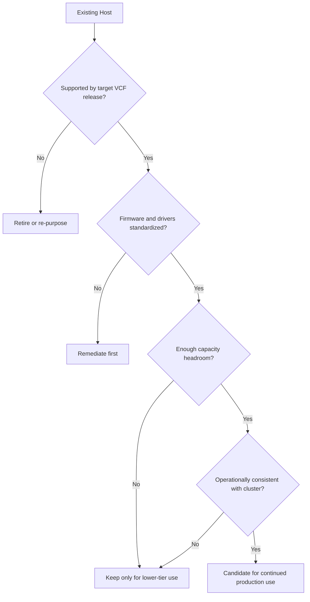

# Extending Server Lifecycles for VMware Cloud Foundation 9

The decision to keep a server in production is never just a hardware decision. In a VMware Cloud Foundation (VCF) environment, it is an architectural decision that affects lifecycle operations, patchability, platform density, and workload placement for the next several years.

Reusing existing hardware can be a sound strategy when the platform still meets support requirements and the operational model remains clean. It becomes a bad strategy when the team confuses "still functional" with "still worth keeping." The right answer is almost always somewhere in between.

This article focuses on how to evaluate that boundary. The goal is to determine when existing hosts can continue to deliver value inside VCF 9 without creating hidden costs later.

## Reuse is a systems question

A host is reusable only when it fits into the broader system around it. That system includes:

- the supported CPU and chipset generation,
- the NIC and storage controller baseline,
- firmware and driver consistency,
- the cluster's maintenance headroom,
- and the operational burden of keeping the host in lifecycle alignment.

The mistake many teams make is evaluating reuse one server at a time. That is too granular. VCF operates at the cluster and domain level, so a host only matters if it can participate cleanly in those larger constructs.

If one host model requires exceptions, custom firmware drift, or unusual remediation during patch windows, the entire cluster becomes harder to run. A small amount of hardware heterogeneity can have an outsized effect on supportability.

## What to measure before you reuse

A practical reuse assessment starts with four measurements.

### 1. Capacity headroom

Measure actual host utilization under normal and elevated conditions, not just at steady state. A cluster that averages 45 percent CPU and 55 percent memory can still be risky if it cannot absorb a host evacuation during maintenance.

Look for:

- usable memory after platform overhead,
- CPU ready time under load,
- storage latency during background operations,
- and evacuation behavior during host maintenance.

### 2. Compatibility margin

Confirm supportability against the target VCF release and hardware compatibility guidance. That includes not just the CPU family, but also:

- storage adapters,
- network adapters,
- boot devices,
- firmware versions,
- and any dependencies on vendor-specific drivers.

A server can appear fine until a lifecycle action exposes an unsupported component.

### 3. Operational consistency

Ask whether all hosts can be managed the same way. If the answer is no, the reuse case is weaker. Consistency matters because VCF is designed to minimize variance across the stack.

### 4. Future growth room

Today's acceptable host may become tomorrow's bottleneck. Reuse only works when the platform can still absorb growth without forcing premature redesign.

## A simple evaluation model

This is a useful mental model because it forces you to separate "technically possible" from "operationally sensible."

## Where reused hardware fits best

Not every supported host should stay in the primary production cluster. A better pattern is to place older but still viable systems in roles that match their strengths.

Good fits include:

- lower-tier workload domains,
- non-latency-sensitive virtual machine clusters,
- dev/test environments,
- burst capacity,
- and secondary clusters with narrower service expectations.

This lets you preserve value without making the entire estate depend on the weakest hardware generation.

## Where reuse becomes risky

Reuse becomes risky when the host is no longer a good citizen in the cluster. That usually shows up as one or more of the following:

- uneven memory density across hosts,
- slow evacuation during patching,
- poor CPU feature alignment,
- repeated firmware exceptions,
- or storage and network variance that affects DRS behavior.

At that point, the host is still usable in theory, but it increases the cost of every future maintenance event.

A common anti-pattern is keeping a marginal host in production because it "still works." That logic usually shifts risk into the operations team and the next incident review.

## A more durable strategy

The most durable approach is to classify hosts into three buckets:

1. **Primary production** — current-generation or near-current hardware with strong headroom and clean supportability.
2. **Secondary production** — supported hardware that remains functional but is no longer the best platform for the most demanding workloads.
3. **Retirement path** — hardware that is technically alive but no longer worth the operational burden.

That model gives the team a clearer basis for placement decisions and avoids emotional debates about whether a server is "too old" in the abstract.

## Practical guidance

If you are deciding whether to keep existing hardware in a VCF 9 platform, use this order:

- verify supportability first,
- normalize firmware and drivers,
- measure usable memory and evacuation headroom,
- test maintenance workflows before production use,
- and define explicit retirement thresholds.

If the hardware only works when the platform is static, it is not a good long-term citizen.

## Closing thought

The goal of reuse is not to avoid change forever. The goal is to extend the useful life of hardware while preserving the discipline that keeps the platform supportable. That distinction is what separates good architecture from delayed procurement.

## VMware Explore 2026 Session

This article was inspired by the VMware Explore 2026 session:

**10 Tips for Reusing Existing Hardware for VMware Cloud Foundation 9 Deployments**  
**Session ID:** CLOB1216LV

## References

- VMware Compatibility Guide
- VMware Cloud Foundation documentation
- Hardware vendor lifecycle and firmware guidance
