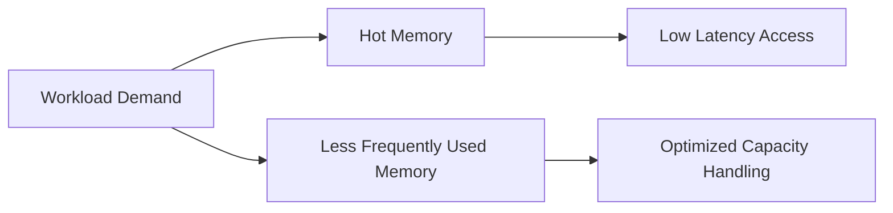

# Rethinking Memory Economics in VMware Cloud Foundation

Memory has become the most expensive form of headroom in many private cloud environments. CPU density continues to improve, but memory demand grows more quickly than many platform teams expect, especially after years of workload consolidation and application sprawl.

That is why memory strategy matters so much in VMware Cloud Foundation (VCF). If you only size for CPU, you will eventually discover that memory is what limits consolidation, maintenance flexibility, and overall cost efficiency.

This is where memory tiering and related platform optimizations become interesting. They are not just performance features. They are economic levers.

## Why memory is the real constraint

In many production environments, CPU looks abundant long after memory starts to pin the platform. That is because modern workloads are often:

- memory-hungry,
- overprovisioned at the guest level,
- inconsistent in active versus configured memory,
- and coupled to application stacks that are difficult to compact.

The result is a platform where the apparent bottleneck is compute, but the real constraint is memory capacity per host and per cluster.

Once that happens, the platform loses flexibility. You can no longer evacuate hosts comfortably, consolidate as aggressively, or absorb a workload surge without creating pressure elsewhere.

## The economics of usable memory

The important number is not installed memory. The important number is usable memory after you account for:

- VCF platform overhead,
- management domain services,
- tenant workloads,
- HA reserve,
- maintenance headroom,
- and the allocation inefficiency that comes with fragmented host capacity.

If the cluster has 3 TB installed but only behaves like 2.2 TB under operational conditions, then the economic model should be built around 2.2 TB, not the headline number.

That is a hard lesson, but it is the one that matters.

## Where memory tiering changes the equation

Memory tiering is valuable because it can improve how a system uses available memory without pretending all memory access has equal performance characteristics. It gives architects another knob for balancing capacity and cost.

The point is not to replace good capacity planning. The point is to make the existing memory pool work harder.

A simplified mental model looks like this:

When you think about the platform that way, you stop treating memory as a single flat pool and start treating it as a resource that can be managed more intelligently.

## Design implications

If memory tiering is part of your platform strategy, then several design assumptions change:

- memory oversubscription becomes more nuanced,
- host sizing should account for workload locality,
- cluster balance becomes more important,
- and operational monitoring needs to track both pressure and access patterns.

This is not a free lunch. It is an optimization that works best when the surrounding architecture is already disciplined.

## What not to do

Do not use memory tiering as a substitute for bad design.

If your environment already has:

- excessive VM sizing,
- no placement policy,
- poor reclamation discipline,
- and weak observability,

then a memory feature will not solve the underlying problem. It may help, but it will not rescue the architecture.

You still need:

- right-sized virtual machines,
- resource pool discipline where appropriate,
- cluster design that avoids pathological contention,
- and operational visibility into pressure trends.

## Economic effects to watch

The strongest benefits usually appear in three areas:

1. **Delayed hardware refresh** — if the platform can support more workload on the current footprint, you can stretch capital more effectively.
2. **Better consolidation** — if usable memory is allocated more efficiently, host density improves.
3. **Improved flexibility** — if a host can be evacuated and rebalanced more easily, operations becomes simpler.

Those are financial outcomes, but they are enabled by technical design choices.

## Practical guidance

If you are evaluating memory strategy in VCF, look at the problem in this order:

- quantify memory pressure by cluster,
- identify the workloads that drive the most growth,
- measure how much of the footprint is truly active,
- and validate whether platform features can reduce waste without adding unacceptable operational complexity.

The best memory strategy is the one that supports the workload mix you actually run, not the one that sounds elegant in a slide deck.

## Closing thought

Memory is now a first-class architecture variable. In a VCF environment, treating it as an afterthought leads to avoidable cost and avoidable risk. Treat it as a design input, and the platform becomes much easier to justify financially.

## VMware Explore 2026 Session

This article was inspired by the VMware Explore 2026 session:

**Avoiding the RAM-pocalypse: Unlock Total Cost of Ownership Savings with VMware Memory Tiering**  
**Session ID:** CLOB1046LV

## References

- VMware Cloud Foundation documentation
- vSphere memory management guidance
- Platform capacity planning best practices
