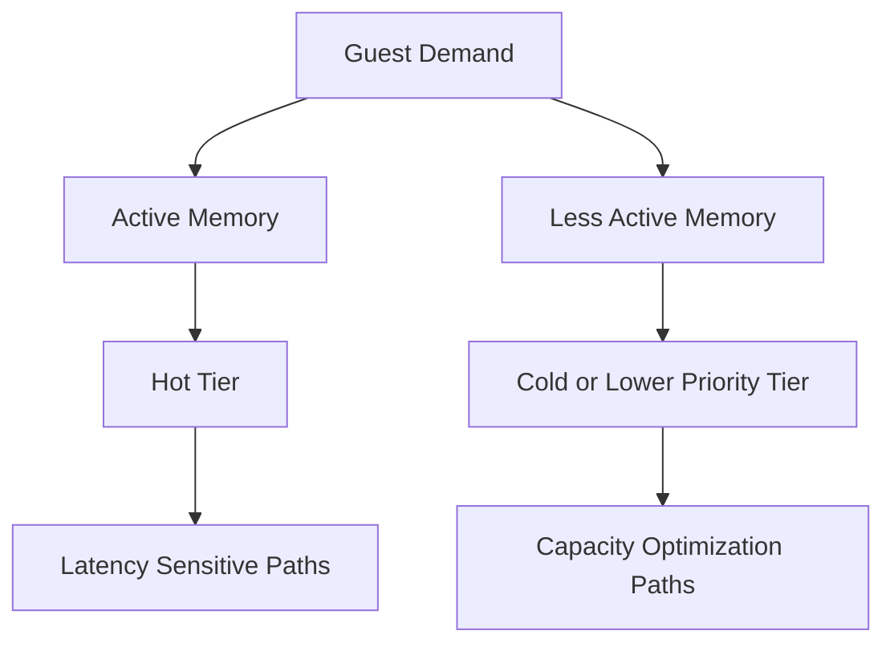

# What Changed in VMware Cloud Foundation 9.1 Memory Tiering

Feature evolution matters when a capability moves from interesting to operationally relevant. Memory tiering in VMware Cloud Foundation 9.1 is worth paying attention to because platform teams do not adopt a feature solely because it exists. They adopt it when it changes the economics or operational behavior of the environment.

That is the lens for this article. The question is not simply what the feature does. The question is what changed in the platform design space because of it.

## Why incremental changes matter

In infrastructure engineering, small changes often have outsized consequences. A minor adjustment in memory behavior can affect:

- consolidation ratio,
- evacuation flexibility,
- workload stability,
- operational thresholds,
- and capital planning.

That is especially true in environments where memory, not CPU, is the limiting factor.

A feature can look modest in isolation and still meaningfully alter platform strategy.

## The architectural view

At a high level, memory tiering introduces a more nuanced model for how memory is consumed, managed, and optimized across the host and cluster. The value is not just in capacity expansion. It is in giving architects a more intelligent way to match workload behavior to available resources.

The key design implication is that not all memory needs identical latency. Once you accept that, the architecture can become more efficient.

## What platform teams care about

When a feature like this arrives, platform teams usually care about four things:

- **Does it reduce pressure enough to matter?**
- **Does it change operational risk?**
- **Does it simplify or complicate troubleshooting?**
- **Does it create a measurable economic benefit?**

Those are the correct questions because infrastructure investment is always justified by a mix of performance, resilience, and cost.

## What changed from a design standpoint

The important shift in VCF 9.1 is not just that memory tiering exists. It is that the feature begins to feel more production-usable as part of a real platform strategy.

That means the conversation changes from "could this help?" to "how should we incorporate it into the standard cluster design?"

At that point, you have to think about:

- host sizing,
- placement strategy,
- monitoring thresholds,
- workload classification,
- and service-tier expectations.

That is a more mature conversation, and it is where architects add the most value.

## Operational considerations

A memory optimization feature is only useful if operations can support it. That means the team should be able to answer:

- How do we observe tier behavior?
- What is the response plan if pressure increases?
- Which workloads are candidates for placement in a tiered architecture?
- How does the feature interact with maintenance windows?

If those answers are unclear, adoption should be cautious and phased.

## Recommended adoption pattern

For most enterprises, the right approach is:

1. validate the feature in a controlled environment,
2. test with representative workloads,
3. measure the impact on host density and evacuation,
4. and only then consider production deployment.

That phased rollout is especially important if the cluster already operates near its capacity threshold. You want evidence, not assumptions.

## Where the feature is most valuable

The strongest use cases are usually:

- memory-constrained clusters,
- environments with mixed workload criticality,
- clusters being stretched to delay refresh,
- and platforms where consolidation is a primary goal.

If the environment already has abundant memory and low pressure, the benefit may be smaller. That does not make the feature unimportant. It just means the business case will be different.

## Closing thought

Memory tiering is best understood as an architectural option that gives platform teams more control over the memory economics of VCF. Used well, it can make the environment more efficient and more flexible. Used carelessly, it becomes just another feature that was enabled without a plan.

## VMware Explore 2026 Session

This article was inspired by the VMware Explore 2026 session:

**A Look into the New Features for Memory Tiering in VMware Cloud Foundation 9.1**  
**Session ID:** INVB1153LV

## References

- VMware Cloud Foundation 9.1 documentation
- vSphere memory management guidance
- Capacity planning and platform design references
