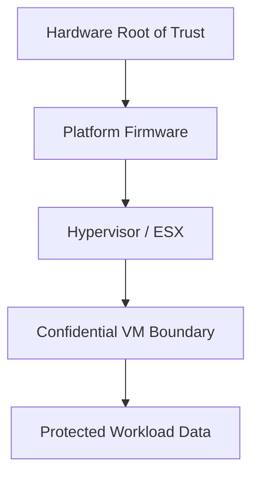

# Inside ESX Confidential Computing: Trust, Isolation, and Security

Security architecture is shifting from perimeter defense toward workload protection that persists even when the infrastructure itself cannot be assumed trustworthy. Confidential computing is part of that shift, and it matters because it changes the security boundary of the cloud stack.

For VMware ESX, the architectural promise is straightforward: reduce the amount of data exposed to components that do not need to see it. The implementation is more nuanced, but the design goal is clear. Protect sensitive workloads more deeply, without giving up virtualization efficiency.

## Why confidential computing matters

Traditional virtualization provides strong isolation between workloads, but the host still plays an important role in memory management, scheduling, and platform control. Confidential computing strengthens the trust model by reducing exposure of sensitive data while it is in use.

That matters for workloads such as:

- regulated data processing,
- financial systems,
- healthcare applications,
- sovereign cloud workloads,
- and environments with strict internal access controls.

In other words, it is not just for highly specialized cases. It is increasingly relevant to mainstream enterprise security planning.

## The trust model

A useful way to think about confidential computing is as a layered trust chain:

The goal is to reduce the number of places where sensitive state is visible in plaintext. That does not eliminate the need for good operational controls, but it narrows the attack surface.

## Security design implications

Once you introduce confidential computing into a platform design, several assumptions change:

- workload placement becomes security-sensitive,
- hardware selection matters more,
- firmware integrity matters more,
- and attestation or verification workflows become part of the operational model.

That means the architecture is no longer simply about “running VMs securely.” It becomes about ensuring that the trust path is valid from hardware through the guest boundary.

## What architects should evaluate

Before making confidential computing part of a production VCF design, evaluate:

- supported hardware capabilities,
- firmware and boot chain controls,
- workload compatibility,
- performance impact,
- operational tooling,
- and incident response implications.

A security feature that is difficult to operate is not a good enterprise feature. The right answer is one that the platform team can actually support during patching, rollback, recovery, and workload mobility events.

## Operational tradeoffs

Security improvements often introduce tradeoffs. Confidential computing can affect:

- placement flexibility,
- live migration behavior,
- compatibility across host generations,
- and troubleshooting complexity.

That does not make the feature less valuable. It just means it belongs in a careful architecture discussion, not a checkbox exercise.

A common mistake is to evaluate the feature only from a security perspective. In production, the right answer must also satisfy availability and operability requirements.

## Where it fits best

Confidential computing is most compelling when you have:

- high-value sensitive workloads,
- a strong need for infrastructure trust reduction,
- compatible hardware across the estate,
- and operational maturity to manage the feature consistently.

In those cases, it can be a meaningful part of a defense-in-depth strategy.

## Closing thought

Confidential computing represents a shift in how we think about trust in virtualized infrastructure. It does not remove the need for discipline elsewhere, but it does give architects a stronger foundation for protecting sensitive workloads inside ESX.

## VMware Explore 2026 Session

This article was inspired by the VMware Explore 2026 session:

**Trust No One: Confidential Computing and Security Inside VMware ESX**  
**Session ID:** CLOB1154LV

## References

- VMware security and confidential computing documentation
- Hardware vendor trusted execution guidance
- Enterprise workload protection architecture references
