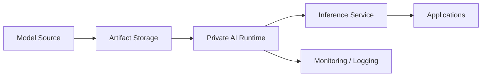

# Bringing Enterprise AI On-Premises with VMware Private AI Model Runtime

Enterprise AI is moving into the infrastructure conversation very quickly. The question is no longer whether teams will run model inference and AI-adjacent services on private infrastructure. The question is how to do it in a way that preserves governance, security, and operational consistency.

VMware Private AI Model Runtime is interesting because it places AI deployment into the same operational world as the rest of the private cloud. That is a meaningful design advantage for organizations that want AI capability without fragmenting their infrastructure model.

## Why on-premises AI matters

Many enterprises want AI capabilities but do not want to push every workload into a public cloud service. Reasons include:

- data residency,
- governance requirements,
- network proximity,
- predictable cost control,
- and integration with existing enterprise platforms.

When AI is deployed on a private infrastructure layer, it can inherit the same controls used for other production workloads. That can be a major advantage.

## The platform view

The model runtime is only one piece of the system. In practice, the architecture spans:

- compute placement,
- GPU or accelerator availability where required,
- storage and model artifact handling,
- network connectivity,
- security boundaries,
- and lifecycle operations.

That makes AI infrastructure design feel less like an isolated lab project and more like an extension of platform engineering.

## What matters to architects

The big questions are not “can it run?” but “can it run predictably in production?”

Architects should evaluate:

- throughput,
- latency,
- model update workflows,
- operational isolation,
- scaling model,
- and observability.

If AI runtime behaves like an unmanaged special case, the platform team will inherit unnecessary complexity.

## Why integration matters

The major value proposition is not only that AI can run on-premises. It is that it can be aligned with the rest of the VCF operating model.

That means:

- standard cluster governance,
- policy-based placement where possible,
- consistent security and access controls,
- and familiar lifecycle operations.

This is exactly the kind of consolidation that enterprise platform teams need. It avoids creating a separate AI island that must be operated by exception.

## Adoption strategy

The best adoption path is to start with one well-understood use case:

- document summarization,
- internal knowledge retrieval,
- support assistant workloads,
- or lightweight inference services.

Then validate:

- latency under load,
- data handling,
- update workflows,
- and monitoring integrations.

Do not begin by trying to solve every AI problem at once. Start with something operationally meaningful and expand from there.

## Closing thought

Private AI only becomes useful when it is operationally sustainable. VMware Private AI Model Runtime is relevant because it helps bring AI workloads into the same engineering discipline that already governs the rest of the private cloud.

## VMware Explore 2026 Session

This article was inspired by the VMware Explore 2026 session:

**Models in Minutes: A Deep Dive into VMware Private AI Model Runtime**  
**Session ID:** INVB1227LV

## References

- VMware private AI documentation
- VCF platform design guidance
- Enterprise AI operations references
