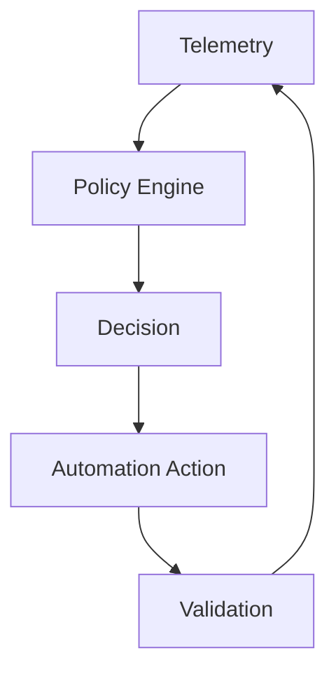

# Building a Self-Driving Private Cloud with VMware Cloud Foundation

The phrase "zero-touch" gets used a lot in infrastructure, but it only becomes meaningful when a platform can make routine decisions safely without requiring an operator to intervene every time. That is the direction modern cloud operations is moving in, and VMware Cloud Foundation is a strong candidate for that model when paired with the right automation layer.

A self-driving private cloud is not fully autonomous in the science-fiction sense. It is a platform where common lifecycle tasks are triggered by policy, verified by telemetry, and executed without waiting for a human to stitch together each step manually.

## What zero-touch really means

Zero-touch IT delivery usually means that the system can handle repetitive work such as:

- rightsizing,
- placement,
- provisioning,
- remediation,
- and standard lifecycle actions.

The human role shifts from execution to policy definition, exception handling, and oversight.

## Why rightsizing matters

Rightsizing is one of the most valuable automation use cases because it directly affects cost, density, and stability. Many environments still run VMs that are larger than they need to be, which increases waste and reduces consolidation opportunities.

If the platform can identify and act on rightsizing opportunities safely, the private cloud becomes more efficient without requiring constant manual review.

## A closed-loop operations model

This is the key to self-driving operations. The system senses state, decides based on policy, acts, and then verifies the result.

## The human role does not disappear

Even in a highly automated model, humans still define:

- guardrails,
- approval thresholds,
- exception handling,
- and escalation paths.

That distinction matters. The point is not to eliminate administrators. The point is to remove repetitive toil so administrators can focus on exceptions and architecture.

## What makes this hard

The hard part is trust. Automation can only be expanded as far as the team trusts the policy model, the telemetry, and the rollback path.

That means you need:

- clear thresholds,
- strong observability,
- auditability,
- and deliberate rollout.

If the system is opaque, no one will let it make decisions at scale.

## Closing thought

A self-driving private cloud is a practical destination if the platform team is willing to operationalize policy as code and feedback as a normal part of operations. VCF is a natural place to do that because it already provides a strong lifecycle foundation.

## VMware Explore 2026 Session

This article was inspired by the VMware Explore 2026 session:

**Autonomous Rightsizing and More: Zero-Touch IT Delivery with VMware Cloud Foundation and Automic Automation**  
**Session ID:** CLOB1703LV

## References

- VMware Cloud Foundation documentation
- IT automation and policy-as-code references
- Observability and rightsizing best practices
