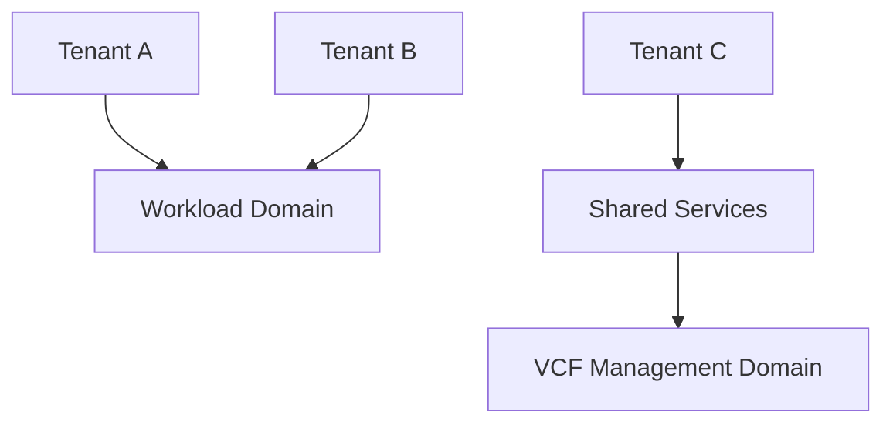

# Designing Multi-Tenant VMware Cloud Foundation Platforms That Scale

Multi-tenancy is one of the most important design challenges in private cloud architecture. It is also one of the easiest to oversimplify. A platform is not truly multi-tenant just because multiple teams use it. It is multi-tenant when the architecture can support separation, governance, and scale without collapsing under operational complexity.

VMware Cloud Foundation is well suited to this problem, but only when the design is deliberate.

## What multi-tenancy really means

A multi-tenant private cloud must provide:

- logical isolation,
- predictable performance,
- policy separation,
- operational clarity,
- and a clean support model.

Those needs often conflict with one another. The architecture must balance them instead of pretending one can eliminate the others.

## The core design tension

The tension in multi-tenant platforms is always the same:

- stronger isolation usually means less density,
- higher density usually means more shared risk,
- and more shared services usually means more governance.

The right design depends on the type of tenants, the workload criticality, and the organization’s risk tolerance.

## A layered view of the platform

In practice, multi-tenancy is a layering problem. The platform must define what is shared and what is isolated at each layer.

## Design considerations

When building a multi-tenant VCF platform, consider:

- tenant segmentation by business unit or service tier,
- network isolation and routing boundaries,
- storage policy differences,
- chargeback or cost allocation,
- operational ownership,
- and lifecycle standardization.

The stronger the tenant separation requirements, the more the design should favor clear domain boundaries.

## Avoiding anti-patterns

Common mistakes include:

- mixing workloads with incompatible availability requirements,
- allowing inconsistent provisioning workflows,
- using too many one-off exceptions,
- and failing to define shared services ownership.

A multi-tenant platform that needs custom handling for every tenant is not scalable.

## What scaling really means

Scaling a multi-tenant VCF environment is not only about adding more hosts. It is also about preserving governance as the tenant count rises.

That means the platform should scale in:

- capacity,
- operations,
- policy management,
- and supportability.

If any of those dimensions breaks, the platform becomes harder to run than the business case can justify.

## Closing thought

A scalable multi-tenant private cloud is not accidental. It is the result of disciplined domain design, clear operational boundaries, and a willingness to standardize where possible while isolating where necessary.

## VMware Explore 2026 Session

This article was inspired by the VMware Explore 2026 session:

**Design & Architect: Building Scalable Platforms in a Multi-Tenant Private Cloud**  
**Session ID:** CLOB1143LV

## References

- VMware Cloud Foundation design guidance
- Multi-tenant security and segmentation best practices
- Private cloud governance references
